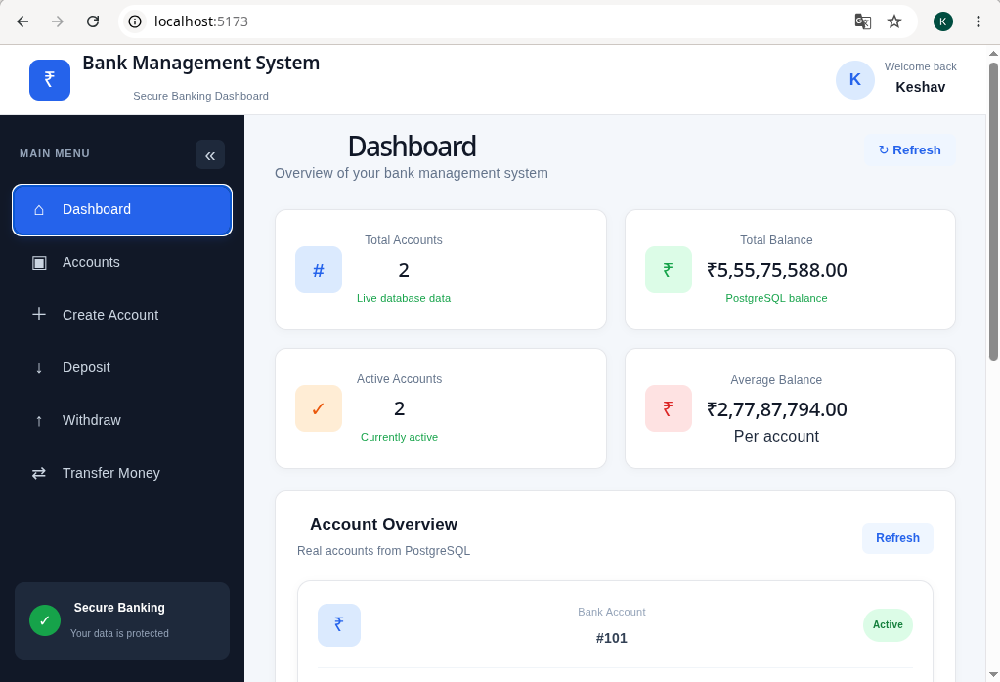
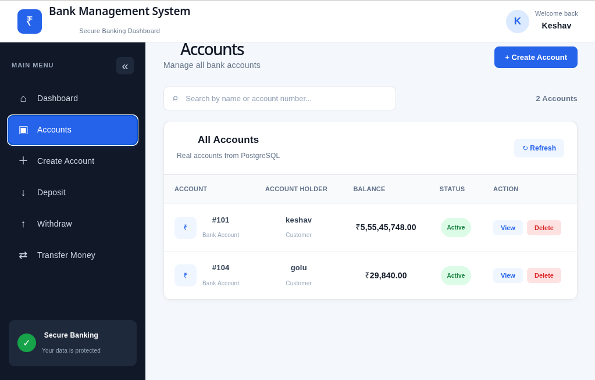
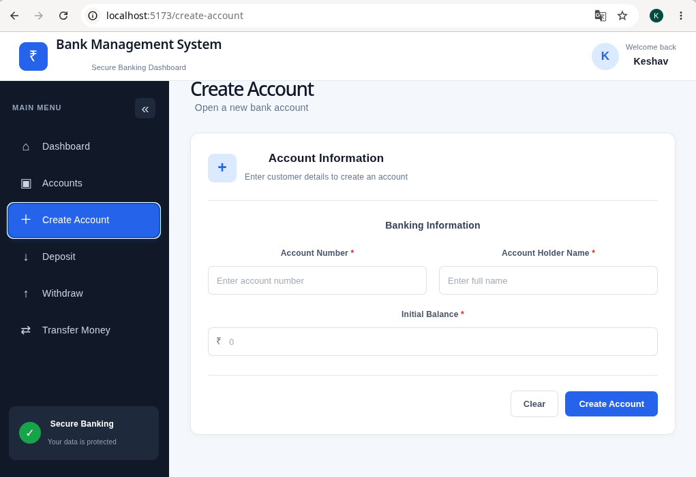
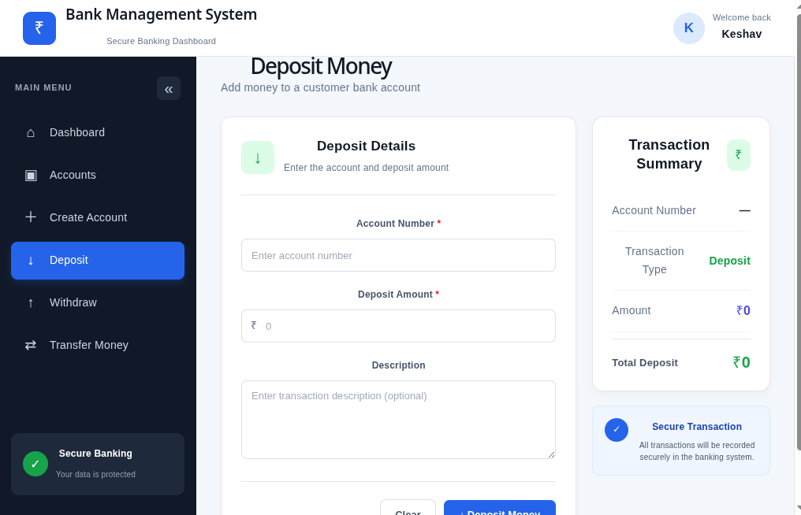
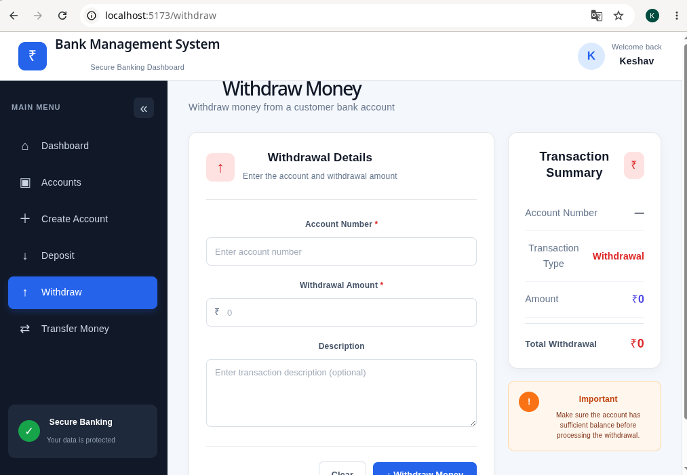
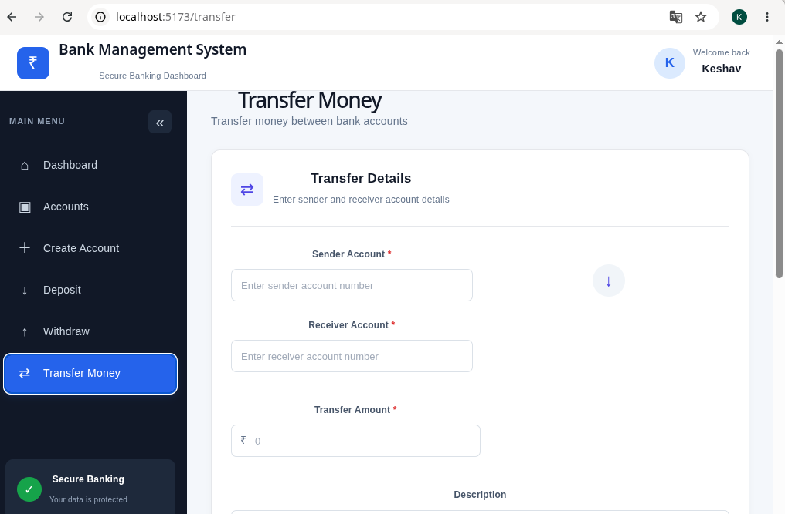

# 🏦 Bank Management System

A full-stack **Bank Management System** built using **React, FastAPI, and PostgreSQL**.

## 🚀 Features

* 📊 Dashboard with account data
* 🏦 Create bank account
* 👥 View all accounts
* 🔍 Search accounts
* 🗑️ Delete accounts
* 💰 Deposit money
* 💸 Withdraw money
* 🔄 Transfer money between accounts
* 🗄️ PostgreSQL database integration
* ⚡ REST API using FastAPI

## 🖥️ Project Screenshots

### Dashboard

### Accounts

### Create Account

### Deposit Money

### Withdraw Money

### Transfer Money

## 🛠️ Tech Stack

### Frontend

* React
* React Router
* Axios
* CSS
* Vite

### Backend

* Python
* FastAPI
* Pydantic

### Database

* PostgreSQL

## 📁 Project Structure

BankManagementSystem/
│
├── app/
│   ├── dao/
│   │   └── bank_dao.py
│   │
│   ├── database/
│   │   └── db.py
│   │
│   ├── models/
│   │   └── bank_Account.py
│   │
│   └── main.py
│
├── frontend/
│   ├── src/
│   │   ├── components/
│   │   ├── pages/
│   │   ├── assets/
│   │   ├── api.js
│   │   ├── App.jsx
│   │   └── main.jsx
│   │
│   ├── package.json
│   └── vite.config.js
│
├── Screenshots/
│   ├── Dashboard.png
│   ├── Accounts.png
│   ├── Create_Account.png
│   ├── Deposit.png
│   ├── Withdraw.png
│   └── Transfer.png
│
├── .gitignore
└── Readme.md

## ⚙️ Installation & Setup

### 1. Clone the repository

bash
git clone https://github.com/keshav642/bank-management-system.git
cd bank-management-system

### 2. Backend Setup

Create a virtual environment:

bash
python3 -m venv venv

Activate it:

bash
source venv/bin/activate

Install dependencies:

bash
pip install fastapi uvicorn psycopg2-binary

Start the backend:

bash
uvicorn app.main:app --reload

### 3. Frontend Setup

Open another terminal:

bash
cd frontend
npm install
npm run dev

The frontend will run using Vite.

## 🗄️ Database

This project uses **PostgreSQL** as the database.

Before running the application, configure your PostgreSQL database connection in the backend database configuration.

> ⚠️ Never upload your actual database password or other secrets to GitHub. Use environment variables such as `.env` for sensitive credentials.

## 👨‍💻 Author

**Keshav Jha**

GitHub: [keshav642](https://github.com/keshav642)

